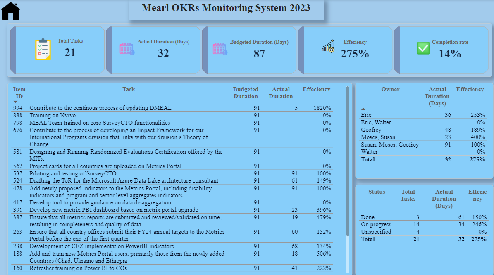
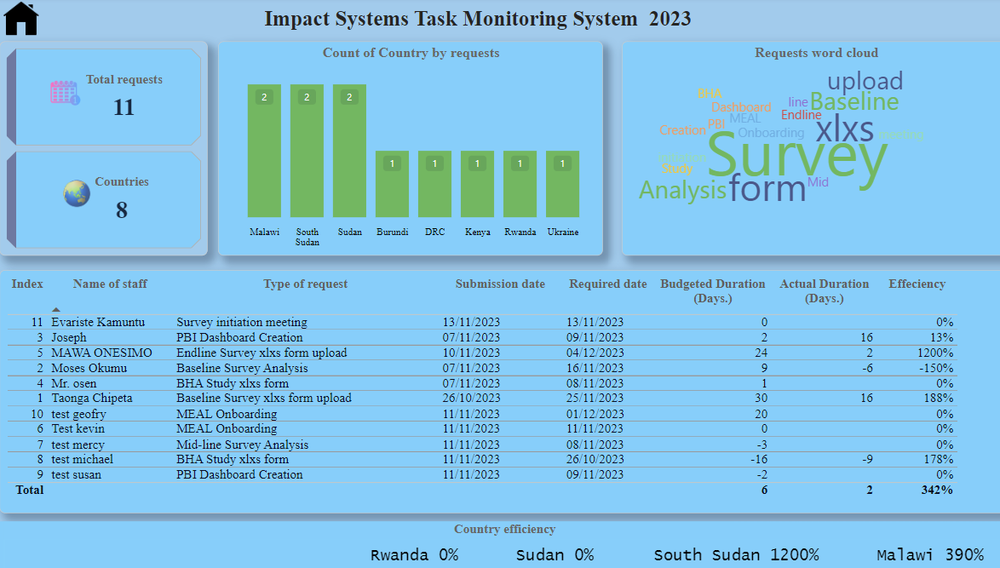

# Objective and Key Results Tracker
The task is to develop a power bi tracker that would track the tasks done by staffs from [Monday.com](https://monday.com/) platform to power BI and automate the process.
Here is final pages of the dashboard.
---
Page 1                              |           Page 2
:---------------------------------:|:------------------:

                        |      

# How?
Linked the Power BI desktop to Monday.com using PBI connector, and performed tranformations.
Created a calendar table as per organization’s FY schedule. 
---
**_Disclaimer_** ; _All data used in this project are dummy data_. 

Incorporated DAX that and calculated Budgeted duration, actual duration, efficiency, and task completion rate. 

Visuals used; 

 -cards
 -matrix table
 -filters
 -scroller
 -word cloud 
 -column chart. 
You can view and interact with the report [Here](https://app.powerbi.com/links/5DG67c-txk?ctid=e8f03421-acdb-4190-87c4-2e45dacd2d1a&pbi_source=linkShare&bookmarkGuid=da30ec98-9762-4bbd-9fc4-cd43c33feb61)
